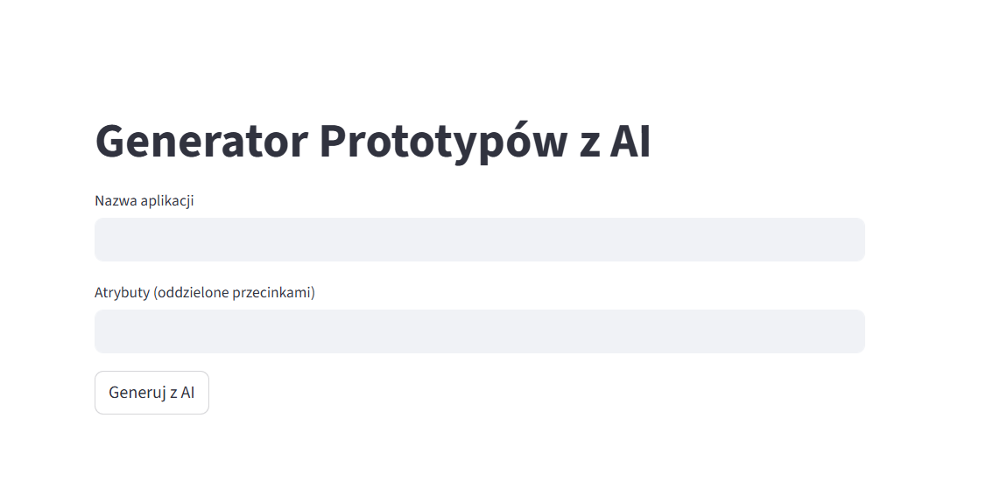

# Generator Prototypów z AI

Aplikacja stworzona jako projekt rekrutacyjny — służy do szybkiego generowania klas Python na podstawie danych wejściowych. Dzięki wsparciu AI (Gemini via OpenRouter), użytkownik może wygenerować kod bez pisania boilerplate. Idealne narzędzie dla junior developerów, PM-ów i startupowców.


## Funkcje
- Interfejs Streamlit do wpisania nazwy i atrybutów
- Generowanie kodu lokalnie lub przez AI
- (planowany)Fallback, jeśli AI nie odpowiada
- Obsługa CLI z argparse
- Parsowanie konfiguracji z YAML (opcjonalnie)
## 🔑 Konfiguracja API

Aby aplikacja działała z AI, potrzebujesz własnego klucza API z [OpenRouter](https://openrouter.ai).

1. Zarejestruj się i wygeneruj klucz
2. Utwórz plik `.env` na podstawie `.env.example`
3. Wklej swój klucz:
👉 Demo online: [Kliknij tutaj, aby uruchomić aplikację](https://generatorprotypuw-awqezszjrxhyspezyqde4y.streamlit.app/)
## 🔄 Ścieżka użytkownika

1. Użytkownik wpisuje nazwę aplikacji i atrybuty
2. Kliknięcie „Generuj z AI”
3. Prompt trafia do OpenRouter (Gemini)
4. AI zwraca kod klasy
5. Kod wyświetlany w UI (lub fallback lokalny(planowany))


## 🚀 Następne kroki

- Dodanie opcji zapisu wygenerowanego kodu do pliku `.py`
- Integracja z GitHub (np. push wygenerowanego kodu)
- Generowanie testów jednostkowych na podstawie klasy
- Tryb demo bez potrzeby podawania klucza
- Landing page z CTA i linkiem do aplikacji

## ⚙️ Technologie i uzasadnienie

- **Python + Streamlit** — szybkie prototypowanie z prostym UI
- **OpenRouter (Gemini)** — dostęp do modeli AI bez konieczności własnego hostingu
- **Dotenv** — bezpieczne zarządzanie kluczem API
- **YAML** — opcjonalna konfiguracja bez potrzeby edytowania kodu
## 🖼️ Interfejs użytkownika

Aplikacja zawiera prosty formularz:
- Pole „Nazwa aplikacji”
- Pole „Atrybuty (oddzielone przecinkami)”
- Przycisk „Generuj z AI”

Po kliknięciu, kod klasy zostaje wygenerowany i wyświetlony w oknie.

## 📊 Walidacja i potencjał

Projekt może być szczególnie przydatny dla osób uczących się programowania lub budujących szybkie prototypy.  
Potencjalne sposoby walidacji:

- Przeprowadzenie testów z junior developerami — porównanie czasu pisania klasy ręcznie vs. z AI
- Udostępnienie demo na grupach programistycznych i zebranie feedbacku
- Analiza użycia w kontekście MVP dla startupów

W przyszłości aplikacja może zostać rozszerzona o:
- Generowanie testów jednostkowych
- Obsługę innych języków programowania
- Integrację z repozytorium GitHub
- połączenie z lokalnymi snippetami


## Uruchomienie
```bash
pip install -r requirements.txt
streamlit run genprototypów.py
